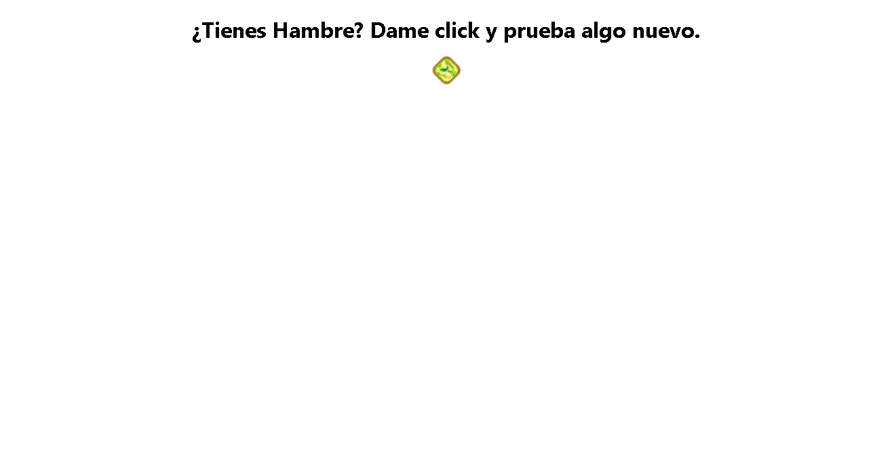
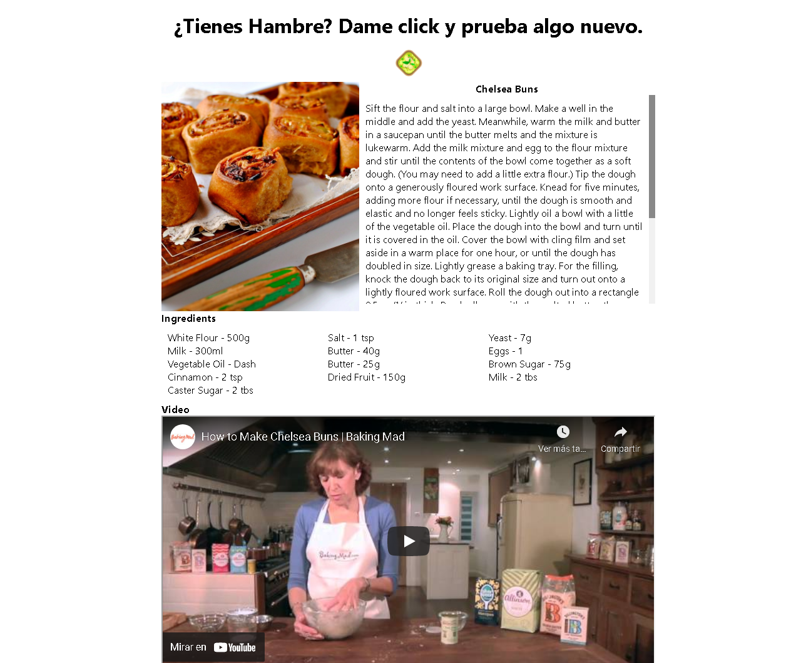

# Random Meal Generator App

Aplicacion que nos busca una receta de cocina al azar dandole clic a un boton.

## **Recursos utilizados**:

- [TheMealAPI](https://www.themealdb.com "theMealAPI")
- [Axios](https://www.npmjs.com/package/axios "Axios")
- HTML
- CSS
- JavaScript

### **Screenshots**:

- Dale clic en el icono de la comida
  

- Aparecera una receta al azar, ¡Magia!
  
